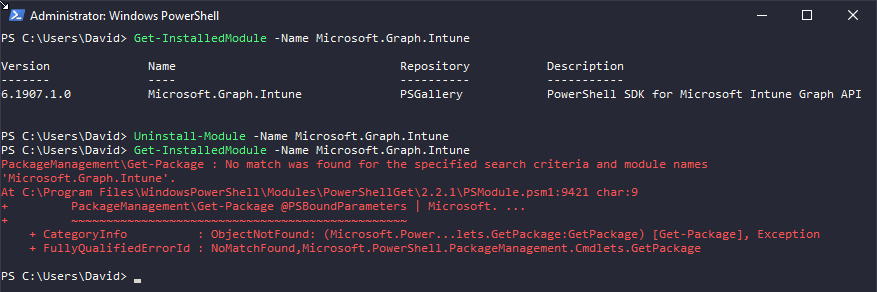

# Table of Contents
- [Table of Contents](#Table-of-Contents)
- [Intro](#Intro)
- [What is the Intune PowerShell SDK?](#What-is-the-Intune-PowerShell-SDK)
- [Getting Started](#Getting-Started)
  - [Setup](#Setup)
    - [Uninstallation](#Uninstallation)
  - [Connecting to the Intune Service](#Connecting-to-the-Intune-Service)
- [Seeing available commands](#Seeing-available-commands)

  
# Intro
This is a quick repo / self-reference "wiki" of sorts (more info will be added to the 'Wiki' for this repo!
  
# What is the Intune PowerShell SDK
It's a list of PowerShell cmdlets that connect directly to the Intune Graph API and lets you perform actions remotely via PowerShell instead of directly via Graph. 
  
# Getting Started
## Setup
 - Install the Microsoft.Graph.Intune module the direct repo [here](https://www.powershellgallery.com/packages/Microsoft.Graph.Intune)
 - Alternatively, you can run this from a PowerShell session that you ran as Admin using a single command.
```PowerShell
Install-Module -Name Microsoft.Graph.Intune
```

## Uninstallation
You can uninstall this PowerShell Module by simply running the below command:

```PowerShell
Uninstall-Module -Name Microsoft.Graph.Intune
```


## Connecting to the Intune Service
```PowerShell
Connect-MSGraph
```

This is straightforward - If you have a non-standard environment, such as GCC-High, see official documentation [here](https://github.com/microsoft/Intune-PowerShell-SDK/blob/master/README.md#Each-time-you-use-the-module) on how to connect and use it. 

Note - other features, such as Conditional Access, can block this.
Make sure you connect using a **Global Administrator** account. 

# Seeing available commands
You can use the following line to retrieve all commands available in the module (once connected)
```PowerShell
Get-Command -Module Microsoft.Graph.Intune
```

However, this gives a massive list of commands, as seen below...


If you want to filter this list to be smaller, or you know what you are looking for - you can edit this command to do something such as...
For example - I want a nice table of commands that are related to certificates. 

```PowerShell
Get-Command -Module Microsoft.Graph.Intune -Name *Certificate* | FT CommandType,Name
```

